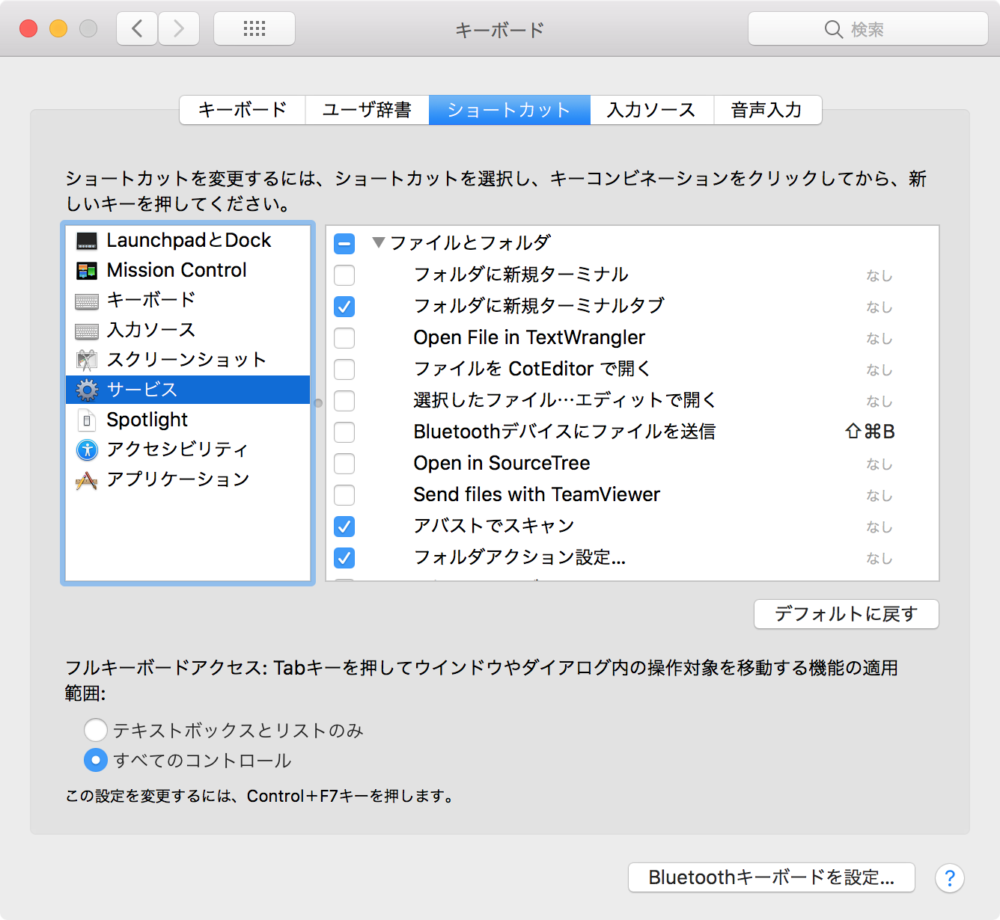

# MacOSのサービスメニューをカスタマイズする
<!-- date: 2017-10-12 23:26:00 -->

サービスメニューとはフォルダやファイルを右クリックした際に表示される例の項目です。便利な面がある一方でアプリが増えるにつれてあまり使わなそうなメニューが増えてきてしまうのも事実。

そんな時は

システム環境設定 / キーボード / ショートカット / サービス
にて表示する項目をトグルできます。

こんな感じで↓
 

便利です。